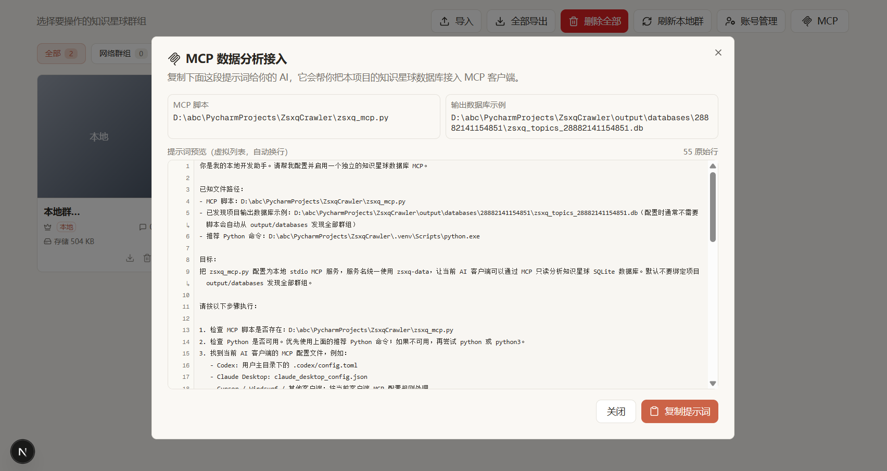

<div align="center">
  
  <h1>知识星球数据采集器</h1>
  <p>知识星球内容爬取与文件下载工具，支持话题采集、文件批量下载等功能</p>
  <p>如需定制功能，请联系 QQ：2977094657</p>
  <p>
    <a href="https://qun.qq.com/universal-share/share?ac=1&amp;authKey=Yw16I2kCy6Z7qgJablWKtBhG%2BnEtijbbRGcFeBsCbxf8cW4fieCflIkmeIxsN0CZ&amp;busi_data=eyJncm91cENvZGUiOiIxMDk3NDMxMjIyIiwidG9rZW4iOiJHbWtaV3krcEo1STdrYUR0eFpKcklrQjU0UHhqQnA4MTh0YVoyWjhsRUJZN3BvUTFydEVFN3BFWTVXcmgxSjN1IiwidWluIjoiMjk3NzA5NDY1NyJ9&amp;data=GUL6QuPXl4jJpZxgKNjmkTk1QHsB-DG1KKiUwrDiYJ3bkS7EFbU1PDiRKxtmwWix4y1m3CGc6mfVr7_h5lrfjw&amp;svctype=4&amp;tempid=h5_group_info" title="点击链接加入群聊【ZsxqCrawler】">
      
    </a>
  </p>
  
  
</div>

## 界面展示

<div align="center">
  
  <p><em>首页 - 群组选择和概览</em></p>
</div>

| 配置页面 | 日志页面 |
| --- | --- |
|  |  |
| <em>配置页面 - 爬取间隔设置</em> | <em>日志页面 - 实时任务执行日志</em> |

<div align="center">
  
  <p><em>专栏文章页面 - 专栏目录浏览、文章内容展示与视频下载</em></p>
</div>

<div align="center">
  
  <p><em>导入数据包 - 导出信息预览、社群列表和冲突检查</em></p>
</div>

## MCP

Web 首页顶部右上角提供 **MCP** 按钮，点击后会弹出项目专属提示词，用户复制给 AI 后，AI 可按提示自动配置 MCP 客户端。

<div align="center">
  
  <p><em>MCP 数据分析接入 - 复制提示词即可让 AI 配置客户端</em></p>
</div>

## QQ 交流群

欢迎扫码或点击图片加入 QQ 交流群，交流使用经验、互换星球、反馈问题与建议。

<div align="center">
  <a href="https://qun.qq.com/universal-share/share?ac=1&amp;authKey=Yw16I2kCy6Z7qgJablWKtBhG%2BnEtijbbRGcFeBsCbxf8cW4fieCflIkmeIxsN0CZ&amp;busi_data=eyJncm91cENvZGUiOiIxMDk3NDMxMjIyIiwidG9rZW4iOiJHbWtaV3krcEo1STdrYUR0eFpKcklrQjU0UHhqQnA4MTh0YVoyWjhsRUJZN3BvUTFydEVFN3BFWTVXcmgxSjN1IiwidWluIjoiMjk3NzA5NDY1NyJ9&amp;data=GUL6QuPXl4jJpZxgKNjmkTk1QHsB-DG1KKiUwrDiYJ3bkS7EFbU1PDiRKxtmwWix4y1m3CGc6mfVr7_h5lrfjw&amp;svctype=4&amp;tempid=h5_group_info" title="点击链接加入群聊【ZsxqCrawler】">
    
  </a>
  <p><em>扫码或点击图片加入 QQ 交流群</em></p>
</div>

## 快速开始

### 1. 安装部署

```bash
# 1. 克隆项目
git clone https://github.com/2977094657/ZsxqCrawler.git
cd ZsxqCrawler

# 2. 安装uv包管理器（推荐）
pip install uv

# 3. 安装依赖
uv sync
```

### 2. 获取认证信息

在使用工具前，需要获取知识星球的 **Cookie**（无需再手动填写群组ID）：

1. **获取Cookie**:
   - 使用浏览器登录知识星球
   - 按 `F12` 打开开发者工具
   - 切换到 `Network` 标签
   - 刷新页面，找到任意API请求
   - 复制请求头中的 `Cookie` 值

2. **首次使用**：
   - 启动 Web 界面后，在“配置认证信息/账号管理”中粘贴 Cookie 完成登录
   - 后端会根据该账号自动获取您加入的全部星球，前端选择不同星球时会将对应的群组ID动态传入后端进行抓取

### 3. 运行应用

#### 方式一：Web界面（推荐）

```bash
# 1. 启动后端API服务
uv run main.py

# 2. 启动前端服务（新开终端窗口）
cd frontend
npm run dev
```

如果前后端不在同一台机器/容器中，前端默认请求 `http://localhost:8208` 会导致 `Failed to fetch`，请在 `frontend/.env.local` 中配置后端地址（示例）：

```bash
NEXT_PUBLIC_API_BASE_URL=http://192.168.x.x:8208
```

然后访问：
- **Web 界面**: http://localhost:3060
- **API 文档**: http://localhost:8208/docs

#### 方式二：命令行工具

```bash
# 运行交互式命令行工具
uv run -m backend.zsxq_interactive_crawler
```

<div align="center">
  
  <p><em>命令行界面 - 交互式操作控制台</em></p>
</div>

## 贡献指南

欢迎提交Issue和Pull Request！

## 许可证

本项目采用 [MIT License](LICENSE) 开源协议。

## 免责声明

本工具仅供学习和研究使用，请遵守知识星球的服务条款和相关法律法规。使用本工具产生的任何后果由使用者自行承担。

---

<div align="center">
  <p>如果这个项目对你有帮助，请给个 Star 支持一下。</p>
</div>
